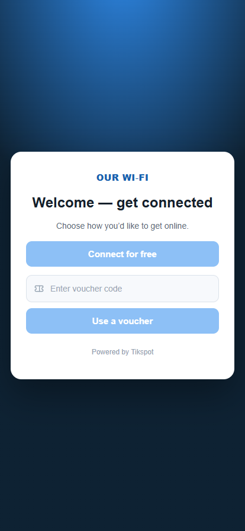
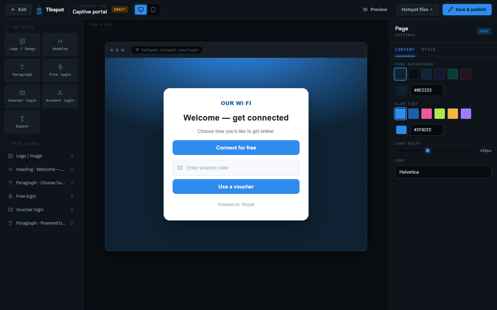
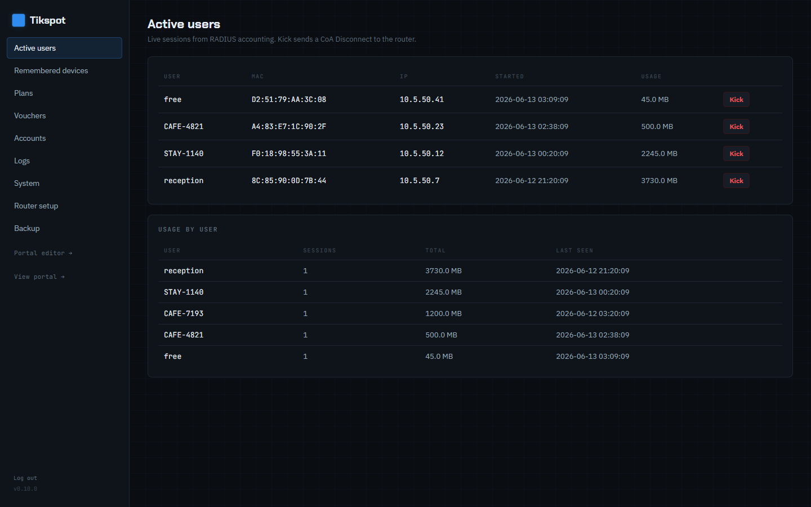
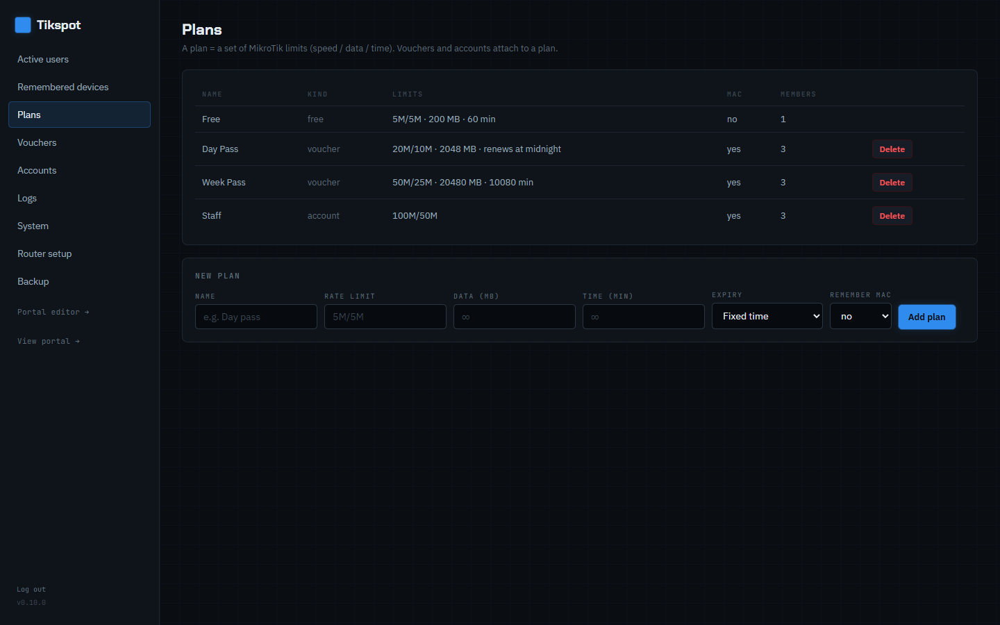
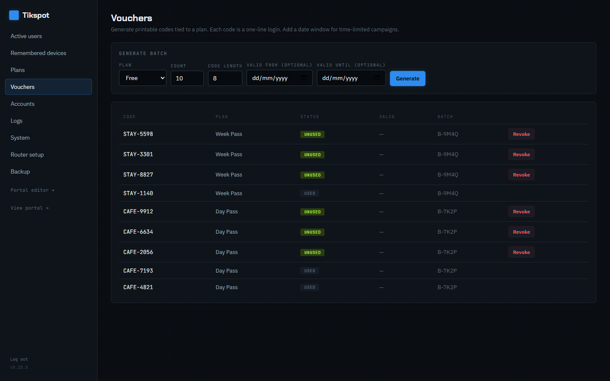
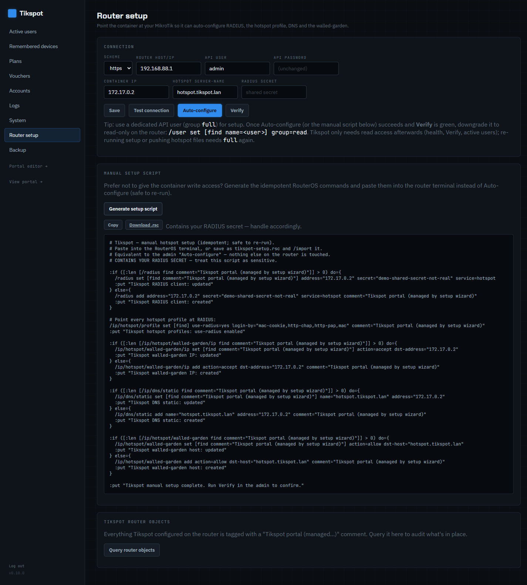

# Tikspot

A single, self-contained container that runs **on a MikroTik router** (RouterOS v7
`container` feature) and provides a complete Wi‑Fi hotspot stack — captive portal,
RADIUS authentication, and a web admin — with no external servers.

- **FreeRADIUS** authenticates hotspot users and applies speed / data / time limits via
  MikroTik vendor attributes, sharing one SQLite database with the app.
- **Live captive portal** — the page your guests see. The router's hotspot redirects
  clients to the container, which renders a customisable login page (free login, voucher
  codes, or user accounts) and posts the final login back to the router.
- **Admin portal** — manage plans, vouchers and accounts; watch and kick active users;
  design the portal page; audit activity; back up/restore; and run a guided first-time
  setup that auto-configures the router for you.

The image stays **under 250 MB** so it fits hotspot-class MikroTik devices (hAP ax²/ax³,
RB5009, x86/CHR). Persistent data lives on a mounted `/data` volume.

> **Version:** 0.10.0 — see [`changelog.md`](changelog.md). LAN-management tool: the admin
> runs over HTTP behind your router, not on the public internet.
>
> **Tested on:** a MikroTik **RB5009 running RouterOS 7.22** (container + FreeRADIUS
> confirmed end-to-end). **Targets RouterOS 7.22 and later** — the `/app`-based install
> needs 7.22+; the file-based install also works on earlier 7.x with the `container` package.

## Screenshots

**The captive portal** — the page guests see when they join the Wi‑Fi. Free login, voucher
codes and account login on one customisable page.

<p align="center">
  
</p>

**The live page designer** — drag-and-drop blocks (logo, heading, text, login widgets) with a
desktop/mobile preview and a full colour picker. No re-uploading files to the router per change.



**The admin** — manage everything from one LAN-only web app.

| | |
|---|---|
| **Active users** — live sessions from RADIUS accounting; kick via CoA | **Plans** — MikroTik speed / data / time limits, incl. renew-at-midnight |
| [](docs/img/admin-active-users.png) | [](docs/img/admin-plans.png) |
| **Vouchers** — printable batches with optional date windows | **Router setup** — probe, auto-configure, or copy a manual script |
| [](docs/img/admin-vouchers.png) | [](docs/img/admin-router-setup.png) |

## How it fits together

```
Guest device ──▶ MikroTik hotspot ──redirect──▶ Tikspot container (this project)
                       ▲                              │  live login page
                       └────── login POST ◀───────────┘  (FreeRADIUS auth + limits)
```

The router holds only a few tiny **redirect-shim** files (download them as a zip, or have
the app push them over the API). They hand the hotspot session to the container, which
hosts the real, editable page — so you customise the portal live, without re-uploading
files to the router for each change. FreeRADIUS and the Node app run inside the same
container and share `/data/tikspot.db`; the app projects plans/vouchers/accounts into the
RADIUS tables, and FreeRADIUS remains the single auth authority.

## Features

- **Three login types** per portal: one-tap **free** login, **voucher** codes, and named
  **user accounts** — mix and match on the page.
- **Plans** = MikroTik limits (rate `5M/5M`, data cap, session time). New: **"expire at
  midnight"** plans that renew daily (sessions are CoA-disconnected at the router's local
  midnight for a fresh quota) instead of a fixed time limit.
- **Voucher batches** with optional date-validity windows; printable voucher sheets.
- **MAC re-auth** ("remember device") so returning guests reconnect automatically.
- **Live page designer** — drag-and-drop blocks (logo, heading, text, login widgets) with
  a full **colour picker** (presets + native picker + hex) for background, glow and accent.
- **Guided setup wizard** that probes the router and **auto-configures** the RADIUS client,
  hotspot profile, DNS static and walled-garden — every object it creates is tagged with a
  managed comment and can be **queried back / verified** from the admin (per-component
  pass/fail with the raw RouterOS line).
- **Operations**: live active-users + kick (RADIUS CoA), RADIUS auth logs, an **admin
  audit trail**, container/router **health**, and **backup/restore** (redacted of secrets
  by default) to migrate between devices.

## Stack

| Layer | Choice |
|------|--------|
| Runtime | Node.js 22 + [Fastify](https://fastify.dev) |
| Storage | SQLite via `better-sqlite3` (shared with FreeRADIUS `rlm_sql`) |
| Auth | FreeRADIUS (SQLite backend) + MikroTik vendor attributes; CoA for kick/expiry |
| Supervision | [s6-overlay](https://github.com/just-containers/s6-overlay) |
| Base | Alpine, multi-arch `arm64` + `amd64`, image < 250 MB |

## Repository layout

| Path | What it is |
|------|------------|
| `app/` | Node.js (Fastify) backend + static admin/portal assets |
| `app/src/admin/` | Admin API: auth, setup wizard, plans/vouchers/accounts, backup, logs, validation, audit, rate-limiting |
| `app/src/radius/` | RADIUS projection (`sync`), CoA (`coa`), NAS secret (`nas`), `clients.conf` rendering, midnight-expiry sweeper |
| `app/src/portal/` | Captive-portal rendering + the served `/m/portal.js` client |
| `app/src/mikrotik/` | RouterOS v7 REST client (auto-configure, verify, managed-object listing) |
| `app/src/{db,design,mac,voucher,hotspot}/` | Schema/migrations, design model, MAC re-auth, voucher sweeper, hotspot shim generator |
| `app/public/admin/` | Vanilla-JS admin SPA + the captive-portal page designer |
| `app/test/` | `node --test` unit tests (auth hashing, validators, rate limiter, clients.conf, local-date) |
| `docker/` | Multi-stage, multi-arch Dockerfile + s6 service tree (`00-init`, `db-init`, `radiusd`, `node`) |
| `docs/` | Setup & deployment guides (see below) |
| `deploy/` | `tikspot.app.yml` — RouterOS 7.22+ container **App** manifest (self-provisions networking) |
| `scripts/` | Build helpers (image size gate, RB5009 export) |

## Building

Requires Docker with buildx (Docker Desktop on Windows is fine).

```powershell
npm run build:local     # amd64 image (tikspot:dev) + the <250 MB size gate
npm run build:release   # multi-arch (arm64 + amd64)
npm run export:rb5009   # arm64 -> dist/tikspot-rb5009.tar (RouterOS docker-archive)
```

Run the unit tests:

```bash
cd app && npm test      # node --test
```

**Releases:** pushing a `v*` tag (e.g. `git tag v0.10.0 && git push origin v0.10.0`) runs the
release workflow, which builds the multi-arch image and publishes it to
`ghcr.io/omegatron/tinkernet-tikspot` for the RouterOS App deploy below.

## Deploying to a MikroTik

Two paths, depending on RouterOS version:

1. **RouterOS 7.22+ — container "App"** *(simplest; auto-provisions the network)*: add
   [`deploy/tikspot.app.yml`](deploy/tikspot.app.yml) with `/app add network=lan` and the
   router pulls the public multi-arch image (`ghcr.io/omegatron/tinkernet-tikspot`,
   published on each release tag) and creates the veth, bridge port, IP and NAT for you.
   See [`docs/deploy-app.md`](docs/deploy-app.md).
2. **File-based** *(any RouterOS 7 with the `container` package)*: build the arm64 tar,
   upload it, create the veth, and `/container/add`. See
   [`docs/deploy-rb5009.md`](docs/deploy-rb5009.md) (RB5009 walk-through) and
   [`docs/setup-mikrotik.md`](docs/setup-mikrotik.md) (generic).

Then browse to `http://<container-ip>/admin`, complete the **setup wizard** (set an admin
password, point it at the router, **Auto-configure**), design the portal, and install the
hotspot shim files. [`docs/backup-migrate.md`](docs/backup-migrate.md) covers moving an
existing install to a new device.

## Configuration

All settings have container defaults and can be overridden via MikroTik
`/container/envs` (or `docker run -e`). The router connection, secrets and most options are
configured in the admin wizard and stored in `/data`.

| Env var | Default | Purpose |
|---------|---------|---------|
| `TIKSPOT_NAS_SECRET` | *(generated)* | RADIUS shared secret (router ⇄ container). Set it, or let setup generate one. |
| `TIKSPOT_FREE_USERNAME` / `_PASSWORD` | `free` / `free` | Credential the free-login button submits |
| `TIKSPOT_DB` | `/data/tikspot.db` | Shared SQLite path |
| `TIKSPOT_DATA_DIR` / `TIKSPOT_ASSETS_DIR` | `/data` / `/data/assets` | Persistent data + branding uploads |
| `TIKSPOT_HOST` / `TIKSPOT_PORT` | `0.0.0.0` / `80` | Listen address |
| `TIKSPOT_RADIUS_CLIENT_NET` / `_NET6` | `0.0.0.0/0` / `::/0` | Source range FreeRADIUS trusts (the secret is the gate) |
| `LOG_LEVEL` | `info` | Fastify log level |

## Security notes

This is a LAN-management appliance. Within that scope: the admin password is **scrypt**-
hashed; sessions are **signed, httpOnly, SameSite** cookies; the admin login is
**rate-limited**; state-changing requests get an **Origin/CSRF** check; backups **redact
secrets** by default; and the RADIUS NAS secret **fails closed** (no insecure default).
Don't expose the admin port directly to the internet.

## Development

- Source is plain ES modules (Node 22, `"type": "module"`); no build step at runtime.
- `cd app && npm run dev` runs the server with `--watch` (needs a local SQLite + the
  RADIUS daemon for full function; most easily exercised inside the built container).
- Bookkeeping: [`changelog.md`](changelog.md) (per-version summary) and
  [`changelog_detailed.md`](changelog_detailed.md) (granular log).

## Contributing

Contributions are welcome — see [`CONTRIBUTING.md`](CONTRIBUTING.md) for dev setup, the PR
flow, and the < 250 MB image budget. Please open an issue (use the templates) before starting
non-trivial work. All PRs are gated on passing CI and maintainer review. By participating you
agree to the [Code of Conduct](CODE_OF_CONDUCT.md).

## Reporting issues & security

- **Bugs / features:** open a [GitHub issue](https://github.com/omegatron/tinkernet-tikspot/issues/new/choose)
  using the bug-report or feature-request template.
- **Security vulnerabilities:** please **don't** file a public issue — report privately via the
  repo's **Security → Report a vulnerability** tab. See [`SECURITY.md`](SECURITY.md).

## License

MIT.
